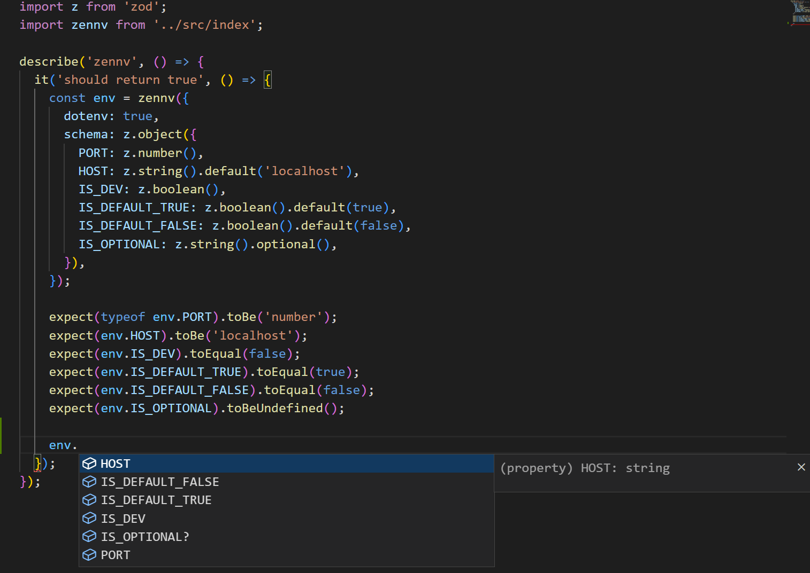

# zennv
Parses environment variables using a Zod schema for type and runtime validation




## Getting started
### Install the package
```bash
yarn add zennv
```

```bash
pnpm add zennv
```

```bash
npm i zennv
```

### Define a Zod schema
```ts
import z from 'zod';

const envSchema = z.object({
  PORT: z.number(),
  HOST: z.string().default('localhost'),
  IS_DEV: z.boolean(),
  IS_DEFAULT_TRUE: z.boolean().default(true),
  IS_DEFAULT_FALSE: z.boolean().default(false),
  IS_OPTIONAL: z.string().optional(),
})
```

### Pass the schema to `zennv`
```ts
import zennv from 'zennv';

const env = zennv({
  dotenv: true,
  schema: envSchema,
});
```

### Use the environment variables
```ts
const { PORT, HOST, IS_DEV, IS_DEFAULT_TRUE, IS_DEFAULT_FALSE, IS_OPTIONAL } = env;
```